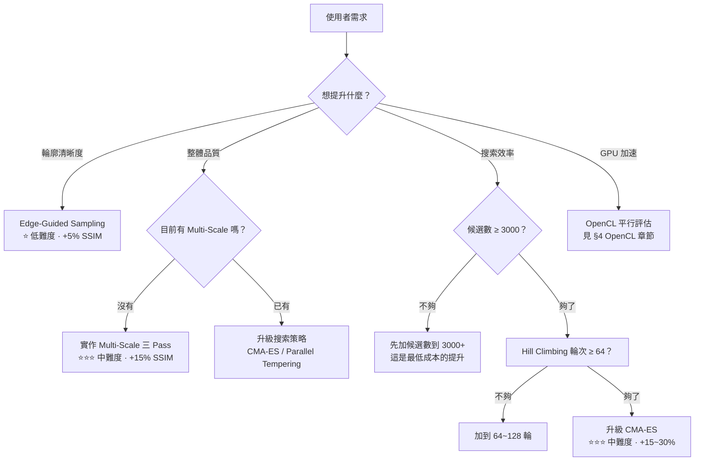
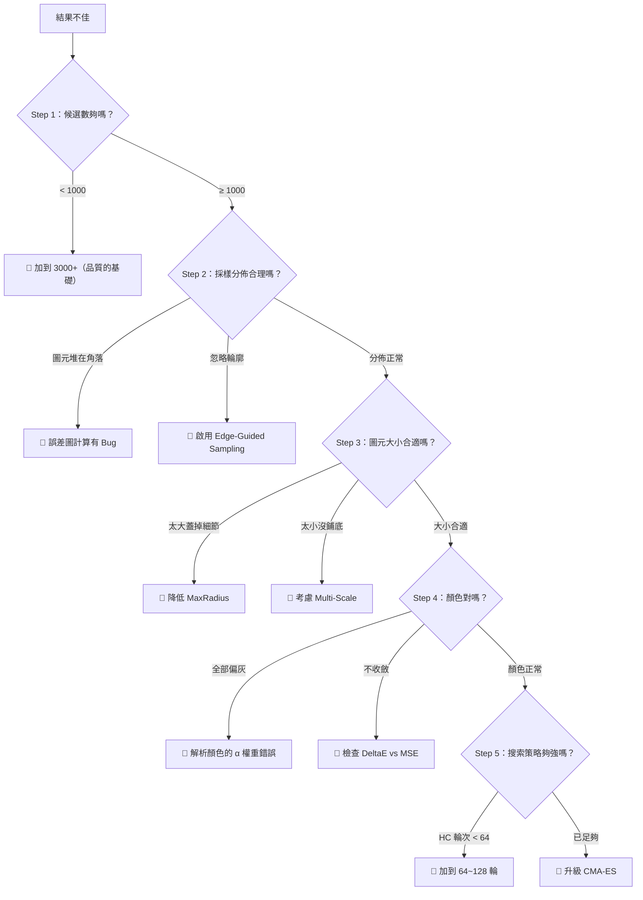
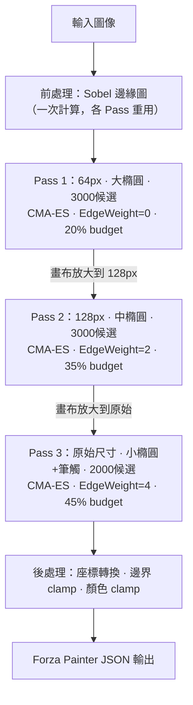

# Geometrize Expert Skill

> **Version:** 2.0
> **Last Updated:** 2026-06
> **基礎依賴：** `global-rules` — 優先決策順序、輸出規範、錯誤修復策略等基礎規範

---

## 行為協議（觸發條件 → 行動）

> 以下定義接到相關任務時**必須遵循的行為路徑**，不是參考資料。

### 觸發詞與對應行動

| 觸發情境 | 必須執行的行動 |
|---------|--------------|
| 使用者說「結果很爛」「品質不好」「看起來很糊」 | 啟動 [診斷框架](#診斷框架結果很爛時的排查流程)，逐步排查 |
| 涉及 OpenCL kernel 修改 | 先檢查 Buffer 生命週期，確認不會 CreateBuffer in loop |
| 涉及採樣策略調整 | 先確認圖像類型 → 查 [EdgeWeight 調參指南](#edgeweight-調參指南) |
| 涉及多尺度架構設計 | 先輸出 [Plan]，須含各 Pass 的解析度/圖元比例/半徑範圍 |
| 涉及演算法升級（Hill Climbing → CMA-ES） | 先評估當前瓶頸是搜索品質還是候選數量，再決定方案 |
| 涉及品質評估 | 必須同時報告 SSIM + PSNR 兩個指標，單一指標不足 |
| 涉及顏色偏差問題 | 先檢查 alpha blending 公式 → 再檢查 DeltaE vs MSE 選擇 |

### 技術決策流程圖



---

## 反模式（禁止事項）

> 以下是在圖元擬合領域中**絕對不能犯的錯誤**。違反任何一條將導致嚴重的品質損失或效能問題。

### ❌ 搜索與採樣

| 反模式 | 後果 | 正確做法 |
|--------|------|----------|
| 候選數 < 500 就開始 Hill Climbing | 搜索空間覆蓋不足，結果全靠運氣 | 最少 1000，推薦 3000~5000 |
| Hill Climbing 的突變幅度固定不衰減 | 後期震盪嚴重，無法收斂到精確位置 | 使用 `mutation *= 0.95` 逐輪衰減 |
| 在 GPU kernel 中用 `rand()` | OpenCL 沒有標準 RNG，結果不可重現 | Host 端預計算隨機種子傳入 kernel |

### ❌ 色彩與渲染

| 反模式 | 後果 | 正確做法 |
|--------|------|----------|
| Alpha blending 用加法而非 Over 合成 | 顏色爆炸、超過 255 | `result = fg * alpha + bg * (1 - alpha)` |
| 解析顏色公式忽略 Alpha 權重 | 所有顏色偏向灰色 | 分子分母都要乘以 alpha_blend_weight |
| 用 RGB MSE 判斷品質就滿意 | 人眼感知與 RGB 距離不一致 | 最終品質用 CIELAB DeltaE + SSIM 評估 |

### ❌ OpenCL 效能

| 反模式 | 後果 | 正確做法 |
|--------|------|----------|
| 每個圖元都 `CreateBuffer` + `ReleaseBuffer` | GPU 記憶體碎片化，速度暴跌 10x | 一次建立，整個 session 重用 |
| kernel 內動態分配記憶體 | OpenCL 不支援 kernel 內 malloc | 預分配 buffer，用 `get_global_id` 索引 |
| 未設定正確的 `CL_MEM_READ_ONLY` / `WRITE_ONLY` | 驅動程式無法優化記憶體存取模式 | 只讀 buffer 標 READ_ONLY，輸出標 WRITE_ONLY |

---

## 領域知識（精簡參考）

### 1. 核心演算法族

#### 1.1 貪心逐步擬合（Geometrize 類）
```
每次加 1 個圖元 → 永久固定 → 只優化當前殘差
搜索三階段：
  ① Random Sampling（N=1000~5000 候選）
  ② Hill Climbing（M=32~128 輪微幅突變）
  ③ 解析顏色求解（閉合解，無需迭代）
侷限：無法回頭修正已固定圖元的次優決策
```

#### 1.2 批次梯度下降（DiffBMP 類）
```
N 個圖元同時優化（PyTorch autograd）
致命問題：Over Blending 順序依賴 → 前層梯度趨零
結論：低維（5~6 參數）問題中，暴力搜索 > 梯度下降
```

#### 1.3 進化策略
```
CMA-ES：學習參數協方差矩陣，自適應搜索方向
  n ≤ 20 維黑盒優化幾乎最強，取代 Hill Climbing 可提升 15~30%

Parallel Tempering：K 條不同溫度的搜索鏈，定期交換
  比 CMA-ES 更抗局部最優，但實作複雜度高
```

---

### 2. 採樣策略

#### 誤差加權（預設）
```go
weight[i] = errorMap[i]  // |target - canvas|
```

#### 邊緣引導（Edge-Guided）
```go
edgeBoost := 1.0 + edgeWeight * edgeMap[i]  // edgeWeight: 1.5~5.0
weight[i] = errorMap[i] * float32(edgeBoost)
```

**Sobel 邊緣圖：** `magnitude = sqrt(gx² + gy²)`，正規化到 `[0,1]`，一次計算各 Pass 重用。

#### EdgeWeight 調參指南

| 圖像類型 | EdgeWeight | 理由 |
|---------|-----------|------|
| 線條插圖、Logo | 5.0 | 邊緣佔主導 |
| 人臉、人像 | 3.0 | 需兼顧膚色漸層 |
| 風景、漸層 | 1.5 | 邊緣弱，過高會產生雜訊 |
| 關閉 | 0.0 | — |

---

### 3. Multi-Scale Hierarchical Fitting

#### 三 Pass 架構

| Pass | 解析度 | 圖元比例 | 半徑範圍 | EdgeWeight | 圖元類型 |
|------|--------|---------|---------|-----------|---------|
| 1 (LowFreq) | 64px | 20% | 8%~45% | 0.0 | 大橢圓 |
| 2 (MidFreq) | 128px | 35% | 3%~15% | 2.0 | 中橢圓 |
| 3 (HighFreq) | 原始 | 45% | 0.5%~4% | 4.0 | 小橢圓+筆觸 |

#### 座標轉換（縮放 → 原始）
```go
scaleX := float64(origW) / float64(scaleW)
shape.X  = int(float64(shape.X) * scaleX)   // 位置縮放
shape.RX = int(float64(shape.RX) * scaleX)  // 半徑縮放
// Angle 不需要縮放
```

---

### 4. OpenCL GPU 加速

#### Host / Device 分工
```
Host (Go/C)：圖像載入、Buffer 管理、kernel dispatch、結果收集
Device (kernel)：候選平行評估、解析顏色計算、評分
```

#### Kernel 簽名參考
```c
__kernel void evaluateCandidates(
    __global const uchar4* target,     // CL_MEM_READ_ONLY
    __global const uchar4* canvas,     // CL_MEM_READ_ONLY
    __global const float8* candidates, // [x,y,rx,ry,angle,r,g,b]
    __global float* scores,            // CL_MEM_WRITE_ONLY
    const int width, const int height,
    __global const float* edgeMap,     // CL_MEM_READ_ONLY
    const float edgeWeight
) {
    int id = get_global_id(0);  // 1 work item = 1 候選
    scores[id] = computeScore(...);
}
```

#### Edge-Aware 評分

在 GPU kernel 的評分函數中，讓覆蓋邊緣區域的候選獲得額外獎勵：

```c
// 評分公式：基礎 MSE 改善 + 邊緣覆蓋獎勵
float baseDelta = oldMSE - newMSE;             // 基礎改善量（正值=改善）
float edgeReward = edgeCoverage * edgeWeight;  // 邊緣覆蓋獎勵
float finalScore = baseDelta + edgeReward;     // 最終分數
```

**注意事項：**
- `edgeCoverage` = 候選覆蓋區域內的邊緣圖平均值（0~1）
- `edgeWeight` 過高會導致圖元密集在邊緣而忽略平坦區域的殘差
- 建議在 Pass 1 關閉（`edgeWeight=0`），Pass 2/3 漸進開啟

---

### 5. 色彩空間與品質

#### 顏色距離
```
MSE（RGB）：快速，不符合人眼感知
DeltaE（CIELAB）：RGB → XYZ → LAB → 歐氏距離，計算 3~5× 慢，品質顯著更好
```

#### 解析最優顏色（Closed-Form）
```
給定形狀覆蓋像素 P，最優 RGBA 顏色有閉合解：
  optimal_c = Σ(target[p].c × α_weight) / Σ(α_weight²)
  結果 clamp 到 [0, 255]
→ GPU 可一次算 3000+ 候選的最優顏色，無需迭代
```

#### 品質指標基準

| 指標 | 良好閾值 | Geometrize 120 層 | Plan A+B 目標 |
|------|---------|-------------------|---------------|
| SSIM | > 0.85 | ~0.74 | 0.87+ |
| PSNR | > 30 dB | ~24 dB | 28+ dB |

```python
# 評估指令（一行搞定）
from skimage.metrics import structural_similarity as ssim, peak_signal_noise_ratio as psnr
print(f"SSIM={ssim(target, rendered, channel_axis=-1):.4f}, PSNR={psnr(target, rendered):.1f}dB")
```

---

### 6. 圖元類型速查

| 圖元 | 參數 | 適用場景 |
|------|------|---------|
| 橢圓 Ellipse | 5 (x,y,rx,ry,angle) | 通用、人臉 |
| 矩形 Rectangle | 5 (x,y,w,h,angle) | 建築、幾何 |
| 三角形 Triangle | 6 (x1,y1,x2,y2,x3,y3) | 輪廓線、斜面 |
| 筆觸 Stroke | 6 (x,y,len,w,angle,…) | 紋理、毛髮（長寬比 4:1~8:1） |
| 貝茲曲線 Bezier | 8 (4 控制點) | 彎曲輪廓（計算最貴） |

---

### 7. Forza Painter JSON 格式

```json
{
  "type": "ellipse",
  "x": 256, "y": 128,
  "rx": 45, "ry": 30, "angle": 0.785,
  "r": 220, "g": 180, "b": 140, "a": 200
}
```

**座標系：** 左上角原點、X 右正 Y 下正、Angle 弧度順時針、Alpha `[0,255]`（通常 100~220）

**邊界保護（必做）：**
```go
rx = min(rx, imgW); ry = min(ry, imgH)
x  = clamp(x, 0, imgW-1); y = clamp(y, 0, imgH-1)
```

---

## 診斷框架：結果很爛時的排查流程



---

## 參考架構：理想的完整系統



---

## 技術選型速查表

| 目標 | 推薦方案 | 難度 | 預期收益 |
|------|---------|----|---------|
| 快速提升輪廓清晰度 | Edge-Guided Sampling | ⭐ | +5% SSIM |
| 全面提升品質 | Multi-Scale Hierarchical | ⭐⭐⭐ | +15% SSIM |
| 搜索效率最大化 | CMA-ES 取代 Hill Climbing | ⭐⭐⭐ | +15~30% 候選品質 |
| 追求極限品質 | Parallel Tempering | ⭐⭐⭐⭐⭐ | +5% (on top of CMA-ES) |
| 更豐富表現力 | 加入筆觸/三角形 | ⭐⭐ | 視覺多樣性 +++ |
| 超越 Geometrize | Plan A + Plan B 同時實施 | ⭐⭐⭐ | SSIM 0.87+ |