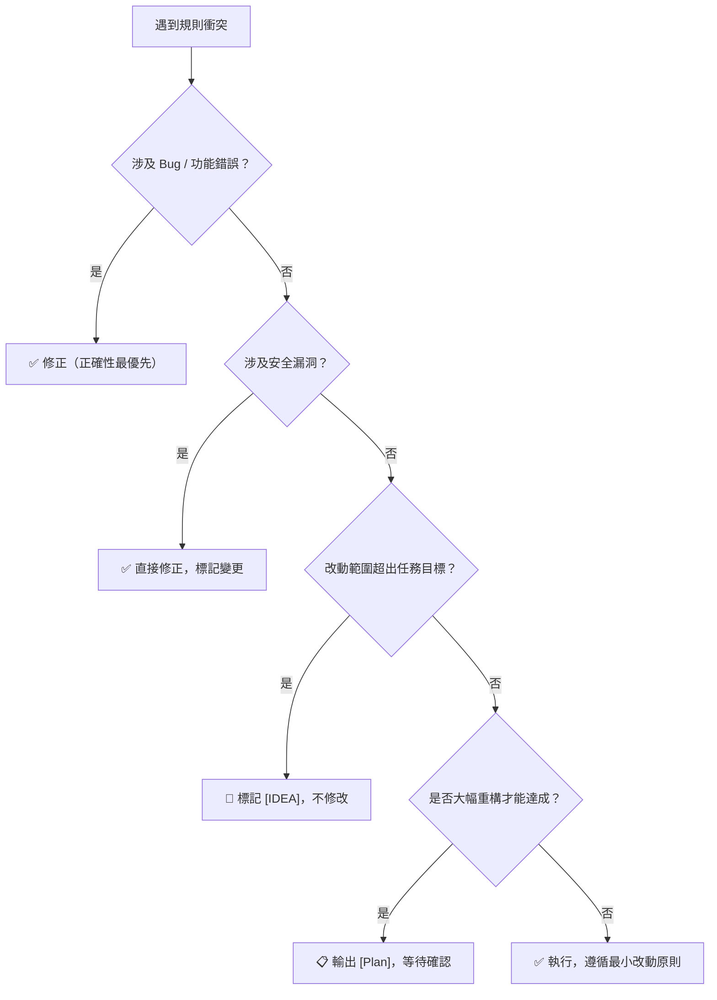

# 衝突決策速查表 (Conflict Resolution Quick Reference)

> 依據 `global-rules` § 優先決策順序：
> **正確性 > 安全性 > 最小改動 > 效能 > 美觀**
> 遇到規則衝突時，對照下表決策。

---

## 常見衝突情境

| 衝突情境 | 決策方向 | 依據 |
|---------|---------|------|
| 保留舊語法（最小改動） vs 使用新語法（現代標準） | **保留舊語法** | 最小改動 > 效能/美觀 |
| 效能優化需大幅重構 | **先輸出 [Plan] 待確認** | 正確性 > 效能 |
| 修正 Bug 會改變外部行為 | **修正 Bug 但標記 Breaking Change** | 正確性最優先 |
| 安全漏洞修正需大幅改動 | **直接修正，無需等待確認** | 安全性 > 最小改動 |
| 發現更優雅的寫法，但非任務目標 | **標記 `[IDEA]`，不動手** | 最小改動 > 美觀 |
| 程式碼格式混亂但功能正常 | **僅修改任務直接相關部分** | 最小改動 > 美觀 |
| 引入新依賴可大幅簡化代碼 | **評估必要性，優先找既有替代** | 最小改動，避免重造輪子 |
| 測試失敗但用戶說「先跳過」 | **標記風險，明確告知後再跳過** | 正確性 > 用戶指令 |

---

## 決策流程圖

---

## [Plan] 觸發快速判斷

| 情況 | 需要 [Plan]？ |
|------|-------------|
| 單一函式修改 | ❌ 不需要 |
| 跨 2 個以上檔案 | ✅ 需要 |
| 架構層級的變動 | ✅ 需要 |
| 需求模糊、不確定性高 | ✅ 需要 |
| 修改共用 Service / Helper | ✅ 需要 |

---

## 停止線 (Hard Stops)

以下情境**必須停手，等待人工確認**，不可自動執行：

- `rm -rf` 或批次刪除資料指令
- 修改 `.env`、金鑰檔、Lock 檔
- 同一問題已自動修復失敗 **3 次**
- 任何涉及生產環境資料庫的 Schema 異動
