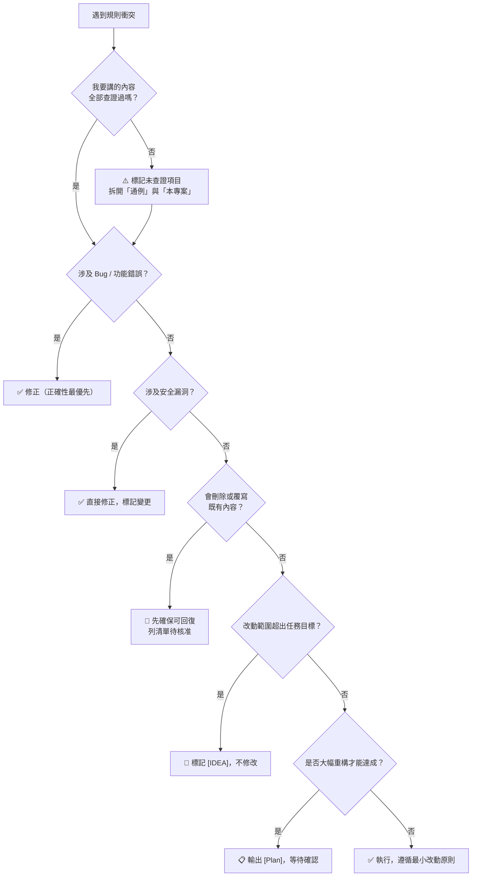

# 衝突決策速查表 (Conflict Resolution Quick Reference)

> 依據 `global-rules` § 優先決策順序：
> **前置條件：誠實（不虛構、不把推測冒充事實）**
> **排序：正確性 > 安全性（含可回復性）> 最小改動 > 效能 > 美觀**
> 遇到規則衝突時，對照下表決策。

---

## 常見衝突情境

| 衝突情境 | 決策方向 | 依據 |
|---------|---------|------|
| 保留舊語法（最小改動） vs 使用新語法（現代標準） | **保留舊語法** | 最小改動 > 效能／美觀 |
| 效能優化需大幅重構 | **先輸出 [Plan] 待確認** | 正確性 > 效能 |
| 修正 Bug 會改變外部行為 | **修正 Bug 但標記 Breaking Change** | 正確性最優先 |
| 安全漏洞修正需大幅改動 | **直接修正，無需等待確認** | 安全性 > 最小改動 |
| 發現更優雅的寫法，但非任務目標 | **標記 `[IDEA]`，不動手** | 最小改動 > 美觀 |
| 程式碼格式混亂但功能正常 | **僅修改任務直接相關部分** | 最小改動 > 美觀 |
| 引入新依賴可大幅簡化代碼 | **評估必要性，優先找既有替代** | 最小改動，避免重造輪子 |
| 測試失敗但用戶說「先跳過」 | **標記風險，明確告知後再跳過** | 正確性 > 用戶指令 |
| 查證做不完 vs 交付時程壓力 | **可交付，但用 ⚠️ 標明哪幾項未查證** | 誠實為前置條件，不得為求完整而省略標記 |
| 新版重構已完成，想順手刪掉舊檔 | **驗證通過前不刪、不覆寫** | 安全性（可回復性）> 美觀 |
| 只查到「A 和 B 都存在」，還沒讀到呼叫那一行 | **判定「查無實質關聯」，不得推論成立** | 誠實：間接證據不能取代直接證據 |
| 想不起來專案怎麼做，但記得業界通例 | **拆兩段講：通例 vs ⚠️ 本專案未查證** | 誠實：不得冠上「我們的／這個專案的」 |
| 該進常駐規則檔的內容寫不進去（權限／鎖檔） | **停下來請使用者核准，不降級塞 KI** | 分類由內容性質決定，不由寫不寫得進去決定 |

---

## 決策流程圖

---

## [Plan] 觸發快速判斷

| 情況 | 需要 [Plan]？ |
|------|-------------|
| 單一函式修改 | ❌ 不需要 |
| 跨 2 個以上檔案 | ✅ 需要 |
| 架構層級的變動 | ✅ 需要 |
| 需求模糊、不確定性高 | ✅ 需要 |
| 修改共用 Service / Helper | ✅ 需要 |
| 批次搬移／刪除／整併檔案 | ✅ 需要（並附完整目標路徑清單） |

---

## 查證深度快速判斷

宣稱「A 對應／依賴／使用／影響 B」時，逐項打勾才算查證完成：

- [ ] 確認 A 存在
- [ ] 確認 B 存在
- [ ] **打開原始碼，找到那一行實際操作的程式碼，並貼出來當證據**
- [ ] 找到支持證據後，追問一次「有沒有反例？」
- [ ] 涉及統計數字：確認「我算的範圍」與「宣稱指涉的範圍」是同一個定義
- [ ] 涉及估規模／派工：照**處理條件**數，不是照「相關」數

第 3 項找不到 → 判定「查無實質關聯」，不得因前兩項成立就推論成立。

---

## 停止線 (Hard Stops)

以下情境**必須停手，等待人工確認**，不可自動執行：

- `rm -rf` 或批次刪除資料指令
- 修改 `.env`、金鑰檔、Lock 檔
- **刪除或覆寫尚未驗證通過的來源檔**
- **批次搬移／整併檔案（動手前須列出完整路徑清單並取得核准）**
- 同一問題已自動修復失敗 **3 次**
- 任何涉及生產環境資料庫的 Schema 異動
- 整份文件重寫等級的清理

---
**最後更新**: 2026-07-23
**維護者**: 開發團隊
**文件版本**: v2.0
**變更記錄**（里程碑，最多 5 條）:
- v2.0 (2026-07-23): 對齊 global-rules v4.0——決策流程圖前置「誠實查證」關卡與「刪除／覆寫」關卡，新增查證深度快速判斷區塊，衝突情境與停止線補上資料可回復性、間接證據、KI 降級三類
- v1.0 (2026-06-15): 首版，依五層優先序建立衝突速查表、決策流程圖、[Plan] 觸發判斷與停止線
